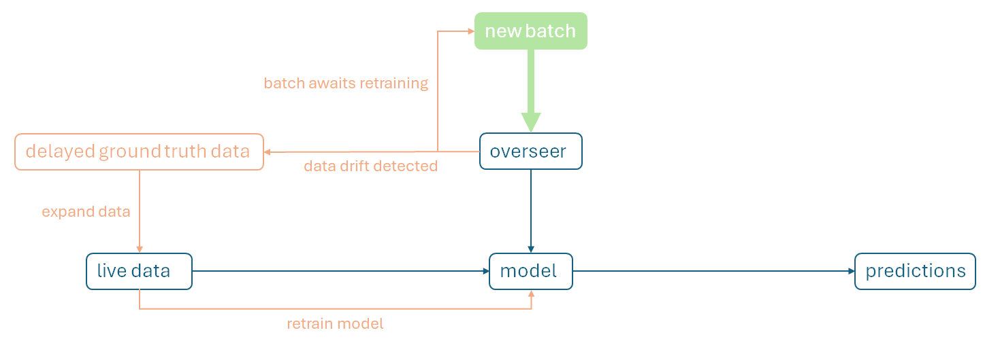
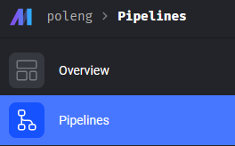
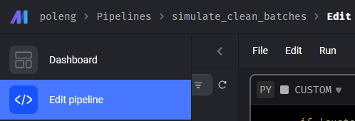
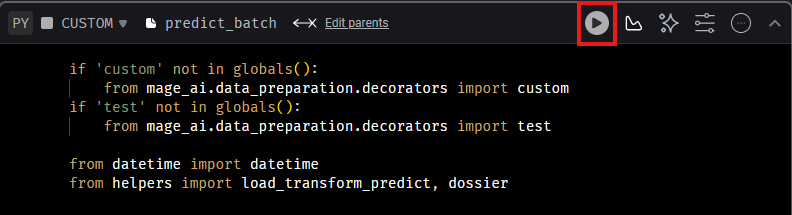

# Political Engagement MLOPS
This project simulates an MLOPS pipeline handling the prediction of political engagement levels (training, tuning, model registry, orchestration, monitoring).
Data comes in batches from the field, predictions are appended to it and sent to the contact centers in a usable format. 
 

## TL;DR
* Duplicate repo: **https://github.com/celupa/political-engagement-mlops**
* Build Docker image (at the project level): **docker build -t poleng_mlops:latest .** 
* Start app: **docker run --rm --name poleng -p 5000:5000 -p 6789:6789 poleng_mlops:latest**
* Browse scenarios with MAGE-AI (Overview > Pipelines): **localhost:6789** 
* Check changes in MLFLOW registry: **localhost:5000**
 

## Context
XGButler is a - fictitious - organization gathering data on the general population.
The organization attempts to assess the political engagement levels of individuals based on variables such as education, income, beliefs... 
Their current production model has been trained with **XGBoost**.
The group aims to identify **politically disengaged** people with the aim of re-engaging them.
The reason? The institution believes that a nation composed of politically engaged and educated individuals fares better in the long-term.
 

## Data 
The original data comes from https://www.worldvaluessurvey.org/WVSDocumentationWV7.jsp.
This data has been **heavily transformed** and customized in a previous project. Optional details can be found here: https://github.com/celupa/political-engagement-analysis
 

## Flow
An initial field study has allowed XGButler to build and train their first production model.
Engaging and educating people politically is tough work. Moreover, societal values are constantly mutating. Therefore, data MUST keep coming to continually correct the evaluation of political levels. 

The data originates in 2 formats:
* **Batches** are a quick way of predicting the political profile of someone and intervene accordingly. This type of data can flow from more or less reputable sources (e.g., government initiatives VS social media)
* **Retrain data** is a continuous academic effort to track changes within a group (economical, political, precepts...). Continuous field studies are the main provider.

Batches are fed to the current model for predictions. Between the batch and the model resides the *ominous overseer*, assessing whether or not the new batch data has drifted (new values in the dataset, prediction drift...).
If **data drift** occurs, then an automated corrective mechanism will check for new field data, assimilate it to the original training data and upgrade the existing model. 

 

## How to 
* For a quick start, check the TL;DR section
* All the project's features can be leveraged without containerizing or starting the app's services (linux only). First, duplicate the repo then see **test scenarios** in **docs/CLI.txt**
* If the app has been dockerized and started as per the TL;DR instructions:
    * Click on **Pipelines** 

    * Click on **Edit**

    * **Launch the script**

